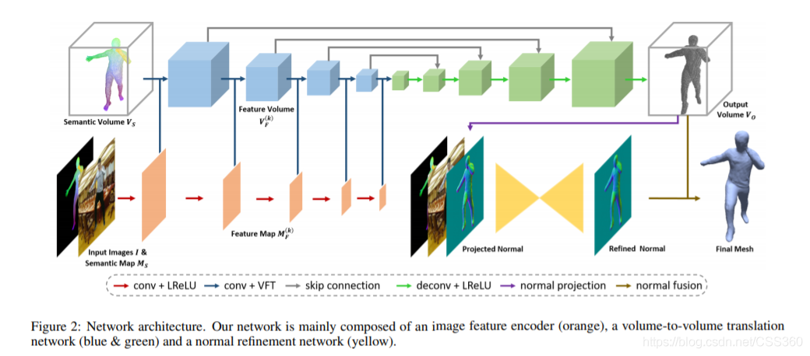
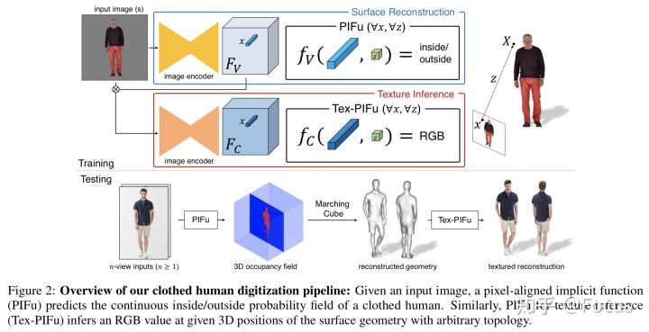
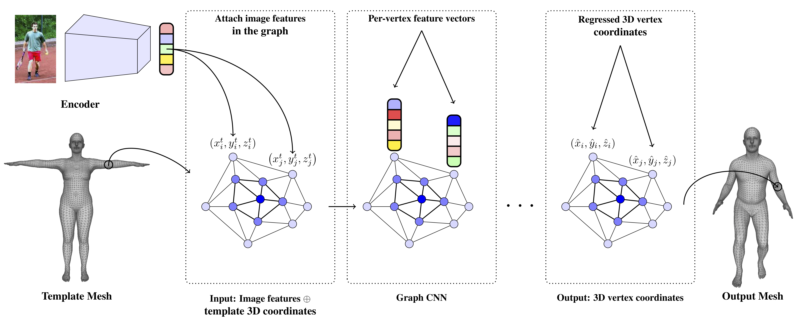

# 单图人体三维重建资料汇总
## 文献调研
### 1. DeepHuman: 3D Human Reconstruction from a Single Image(ICCV 2019)
| [code](https://github.com/ZhengZerong/DeepHuman) | [paper](http://www.liuyebin.com/deephuman/assets/DeepHuman.pdf) |
|  ----  | ----  | 

**网络结构:**

### 2. PIFu

| Version | Code | Paper | 
|  ----  | ----  | ---- | 
| PIFu(ICCV 2019) | [code](https://github.com/shunsukesaito/PIFu) | [PIFu: Pixel-Aligned Implicit Function for High-Resolution Clothed Human Digitization ](https://arxiv.org/pdf/1905.05172.pdf) | 
| PIFuhd(CVPR 2020) | [code](https://github.com/facebookresearch/pifuhd) | [Multi-Level Pixel-Aligned Implicit Function for High-Resolution 3D Human Digitization](https://arxiv.org/pdf/2004.00452.pdf) | 

- PIFu网络结构

### 3. Convolutional Mesh Regression for Single-Image Human Shape Reconstruction
| [code](https://github.com/nkolot/GraphCMR/) | [paper](https://arxiv.org/abs/1905.03244) | 
|  ----  | ----  | 
- GraphCMR网络结构

## 开源数据集

| Dataset | Method |
|  ----  | ----  |
| [THUman](https://github.com/ZhengZerong/DeepHuman/tree/master/THUmanDataset) | DeepHuman | 
| [RenderPeople](https://renderpeople.com/free-3d-people/) | PIFu | 
| [BUFF](http://buff.is.tue.mpg.de/) | PIFu | 
| [Human3.6M](http://vision.imar.ro/human3.6m/description.php) | GraphCMR | 
| [Mosh](http://mosh.is.tue.mpg.de/) | GraphCMR | 
| [UP-3D](http://files.is.tuebingen.mpg.de/classner/up/) | GraphCMR | 
| [DensePose COCO](https://github.com/facebookresearch/DensePose) | Other |
| [3DPW](http://virtualhumans.mpi-inf.mpg.de/3DPW/) | Other |

## 常用数据集模型制作方法
1. 制作3D人偶模型
2. 多角度图片合成

## Comparison
BodyNet在上述三种方法中均被提及到，可视为baseline进行比较 
DeepHuman与GraphCMR在论文中均表示自己比HMR和BodyNet两种方法效果好,由于两篇论文评价指标不一样所以两个算法之间无法比较  
DeepHuman评价指标 Averaged 3D IoU, 测试数据集为THuman  
GraphCMR评价指标 MPJPE与Reconst. Error, 测试数据集为Human3.6M  
PIFu在论文中表示在RenderPeople和Buff数据集上比BodyNet等多种方法效果好(不含DeepHuman与GraphCMR),比较指标也不一样  
速度对比没有提及。

## 深度学习框架平台
| Method | Framework |
| ---- | ---- |
| DeepHuman | TensorFlow |
| PIFu | PyTorch |
| GraphCMR | PyTorch |

## 关键词
| Word | Detail |
| ---- | ---- |
| SMPL | Skinned Multi-Person Linear model |
| MPJPE | Mean Per Joint Postion Error 3D姿态估计常用评价指标，预测关键点和groundtruth之间的平均欧式距离 |
| Reconst. Error | 重建误差 |